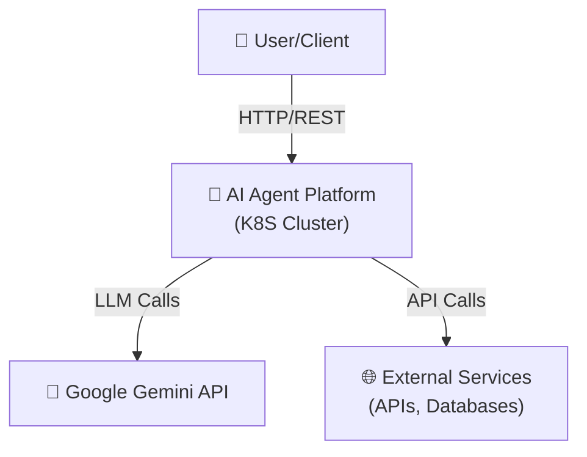
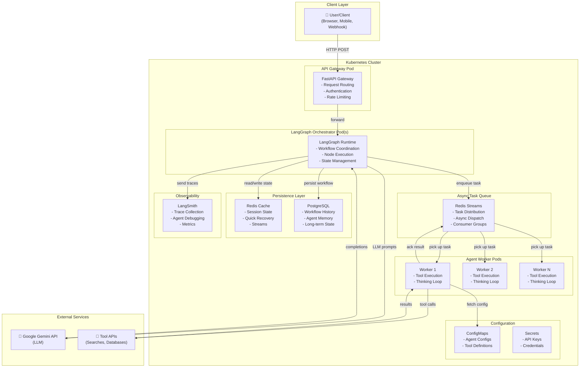
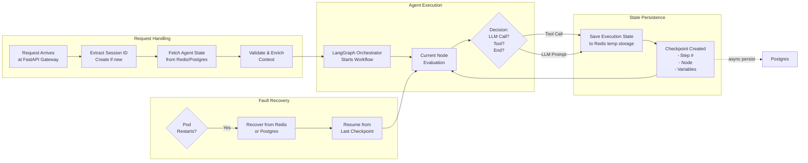

# 2. C4 Architecture Diagrams

## Context

The following three diagrams show the AI Agent Platform architecture at different levels of detail, following the C4 model.

---

## Level 1: System Context

Shows how the AI Agent Platform interacts with external entities:



**Key Interactions:**
- **User → Platform**: RESTful HTTP requests to start/resume agent workflows
- **Platform → Gemini**: LLM API calls for agent reasoning and decision-making
- **Platform → External Services**: Tool execution (search, database queries, third-party APIs)

---

## Level 2: Container Architecture

Detailed view of the main containerized components and their interactions:



**Component Interactions:**
- **FastAPI → LangGraph**: Forwards requests, passes session context
- **LangGraph → Redis Streams**: Asynchronously dispatches tool tasks
- **Workers → Redis Streams**: Pick up tasks, acknowledge completion
- **LangGraph → Redis/PostgreSQL**: Checkpoints state for recovery
- **Workers → Tools**: Execute external tool/API calls
- **LangGraph → Gemini**: LLM prompts and completions
- **LangGraph → LangSmith**: Sends execution traces for observability

---

## Level 3: Component & Data Flow

Detailed component interactions and execution state flow:



**Data Flow Annotations:**

1. **Request Phase**: Incoming request extracted, session validated, prior state loaded
2. **Execution Phase**: LangGraph processes current node, decides next action
3. **Tool/LLM Phase**: Based on decision:
   - **Tool Call**: Enqueue to Redis Streams, wait for worker result
   - **LLM Call**: Send prompt to Gemini, receive completion
4. **State Phase**: After each decision, checkpoint the execution state
   - **Immediate**: Store in Redis (hot cache)
   - **Async**: Background job persists to PostgreSQL
5. **Recovery Phase**: If pod crashes, new pod can recover from checkpoint and resume

---

## Component Relationships

| From | To | Via | Type | Purpose |
|------|----|----|------|---------|
| Client | Gateway | HTTP | Sync | Request submission |
| Gateway | Orchestrator | In-memory | Sync | Pass context to workflow |
| Orchestrator | Redis Streams | XADD | Async | Dispatch tool tasks |
| Orchestrator | Gemini | gRPC | Sync | LLM prompts |
| Workers | Redis Streams | XREAD | Async | Consume tasks |
| Workers | Tools | HTTP/gRPC | Sync | Execute function |
| Orchestrator | Redis | SET/GET | Sync | Checkpoint state |
| Orchestrator | PostgreSQL | SQL | Async | Archive traces |
| Orchestrator | LangSmith | HTTP | Async | Send traces |

---

## Deployment Topology

```
Internet
    ↓ (DNS: api.agent-platform.com)
┌─────────────────────────────────────┐
│ Ingress (nginx/Istio)               │
└────────┬────────────────────────────┘
         ↓
┌─────────────────────────────────────┐
│ Service: api-gateway (LoadBalancer) │
└────────┬────────────────────────────┘
         ↓ (Round-robin traffic)
┌─────────────────────────────────────┐
│ Pods: ai-gateway (x3 replicas)      │
│ • CPU: 500m, Memory: 1Gi            │
│ • Liveness/Readiness probes: 10s    │
└────────┬────────────────────────────┘
         ↓ (gRPC or Service DNS)
┌─────────────────────────────────────┐
│ Service: orchestrator (ClusterIP)   │
└────────┬────────────────────────────┘
         ↓
┌─────────────────────────────────────┐
│ Pods: ai-orchestrator (x2 replicas) │
│ • CPU: 1000m, Memory: 2Gi           │
│ • Affinity rules for spread         │
└────────┬────────────────────────────┘
         ↓ (Redis Streams)
┌────────────────────────────────────────┐
│ Service: redis-cache & redis-streams   │
│ (Can be external or StatefulSet)       │
└────────────────────────────────────────┘
         ↓
┌──────────────────────────────────────┐
│ Service: agent-workers (Headless)    │
└────────┬───────────────────────────┘
         ↓ (Controlled by HPA)
┌──────────────────────────────────────┐
│ StatefulSet: ai-workers (x2-20)      │
│ • CPU: 500m, Memory: 1Gi per pod     │
│ • Triggered by queue depth/CPU usage │
└──────────────────────────────────────┘
```

---

## See Also

- [03-Components](03-components.md) - Detailed component responsibilities
- [04-Async Communication](04-async-communication.md) - Redis Streams deep dive
- [08-Deployment](08-deployment.md) - Kubernetes manifests
