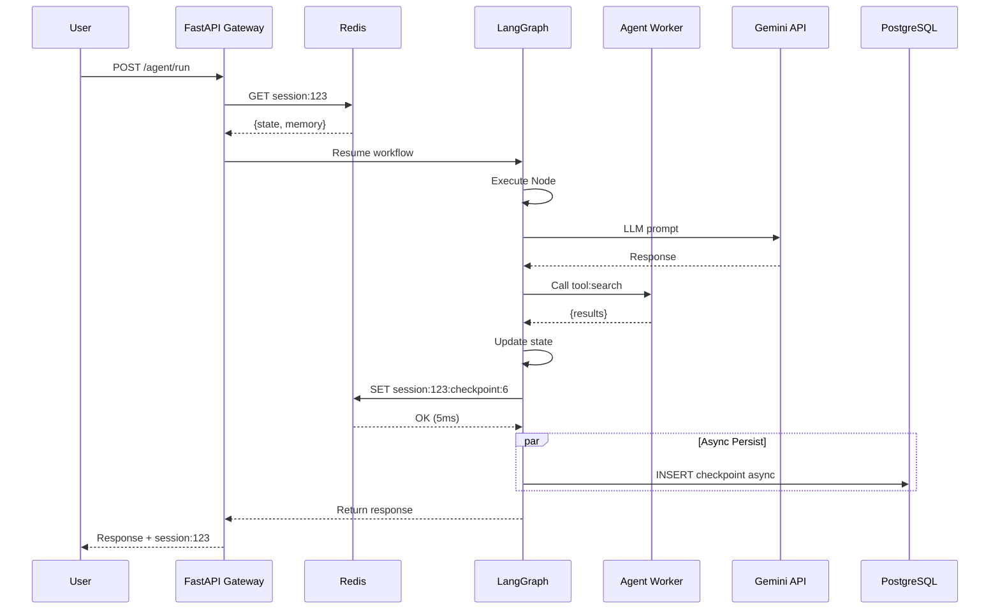

# 5. State Persistence: Stateful Agents

## Problem Statement

Traditional agent systems are stateless. When a Kubernetes pod containing an active agent crashes or is evicted:
- The agent's intermediate reasoning is lost
- Multi-step workflows terminate abruptly
- Users must restart from scratch
- Expensive LLM computations (tokens) are wasted
- Poor user experience on production systems

Example: 10-step multi-agent workflow crashes at step 8 → User reruns from step 1 → 8 LLM API calls repeated → High cost, slow recovery.

## Solution: Stateful Agent with Two-Tier Persistence

We implement checkpoints at every decision point, stored across two persistence layers:

### Tier 1: Redis (Hot Cache)
```
Session State Flow:
┌─────────────────┐     ┌──────────────┐     ┌──────────────┐
│ LangGraph Node  │────▶│ Checkpoint   │────▶│   Redis      │
│ Completes       │     │ Created      │     │ (Immediate)  │
└─────────────────┘     └──────────────┘     └──────────────┘
```

After each LangGraph node execution:
- Capture the complete execution state (variables, messages, internal memory)
- Serialize to JSON
- Store in Redis with key: `session:{session_id}:checkpoint:{step_counter}`
- Set TTL: 24 hours (configurable)
- **Latency**: ~5-50ms per checkpoint
- **Use Case**: Pod crashes; recovery from Redis is instant

### Tier 2: PostgreSQL (Durable Archive)
```
Async Persistence:
┌─────────────────┐     
│ Redis Context   │     
│ Checkpoint      │────────────┐
└─────────────────┘            │
                               ▼ (Async Job, 1-5 sec delay)
┌─────────────────┐     ┌──────────────┐     
│ PostgreSQL      │◀────│ Background   │
│ archive_        │     │ Worker       │
│ checkpoints     │     └──────────────┘
└─────────────────┘     
```

Asynchronously persist to PostgreSQL for:
- Compliance and audit trails (regulatory requirement)
- Recovery if entire Redis cache is lost/cleared
- Historical analysis, replay, and debugging
- **Latency**: 1-5 seconds (non-blocking, background job)
- **Use Case**: Long-term durability, audit

---

## Checkpoint at Each Decision Point



### When Checkpoints Are Created

Checkpoints are created after:
- **LLM calls**: After Gemini responds with completion
- **Tool calls**: After worker returns result
- **Branches**: After if/else decision is made
- **Loops**: After loop iteration completes
- **Workflow end**: Final state before returning to user

### Recovery Scenario

**Before (Stateless System):**
```
User: "Run my 10-step workflow"
    ▼
Steps 1-8 execute fine
    ▼
At Step 8, orchestrator pod evicted (node maintenance)
    ▼
User sees: "Error: Connection lost"
    ▼
User reruns entire workflow
    ▼
Steps 1-8 re-execute (expensive, slow)
    ▼
Only then reaches Step 9
    ▼
Total time: ~2x slower, 2x cost
```

**After (Stateful System with Persistence):**
```
User: "Run my 10-step workflow"
    ▼
Steps 1-8 execute fine, each checkpointed to Redis
    ▼
At Step 8, orchestrator pod evicted
    ▼
LangGraph detects pod is gone
    ▼
User resends request with session_id from response
    ▼
Gateway fetches checkpoint from Redis (5ms)
    ▼
Orchestrator resumes from Step 9
    ▼
User sees uninterrupted workflow completion
    ▼
Total time: Minimal (no re-execution)
```

---

## Implementation Details

### Checkpoint Structure

```json
{
  "session_id": "sess_abc123",
  "step": 6,
  "timestamp": "2026-04-15T10:30:45Z",
  "current_node": "tool_executor",
  "state": {
    "messages": [
      {"role": "user", "content": "Search for AI trends"},
      {"role": "assistant", "content": "I'll search for the latest..."},
      {"role": "tool", "content": "Found 15 articles..."}
    ],
    "variables": {
      "search_query": "AI trends 2026",
      "context": "User asked about market analysis",
      "working_memory": {
        "results_found": 15,
        "articles_analyzed": 5,
        "decision_points_made": 3
      }
    },
    "metadata": {
      "thinking_steps": 12,
      "llm_calls": 2,
      "tools_used": ["search", "summarize"],
      "total_tokens_used": 4532
    }
  }
}
```

### Kubernetes ConfigMap for Checkpointing Policy

```yaml
apiVersion: v1
kind: ConfigMap
metadata:
  name: agent-persistence-config
  namespace: default
data:
  checkpoint_interval: "1"        # After every node
  redis_ttl: "86400"              # 24 hours
  postgres_batch_size: "100"      # Batch inserts
  checkpoint_compression: "zstd"  # Compression algo
  enable_async_persist: "true"
  persist_worker_threads: "4"     # Background workers
```

### Recovery Logic Pseudocode

```python
async def resume_agent_session(session_id: str, request_id: str = None):
    """Resume agent workflow from last checkpoint."""
    
    # 1. Check request-level deduplication first
    if request_id:
        cached_result = await redis.get(f"request:{session_id}:{request_id}:result")
        if cached_result:
            return json.loads(cached_result)
    
    # 2. Try to get latest checkpoint from Redis (hot cache)
    checkpoint_data = await redis.get(f"session:{session_id}:checkpoint:latest")
    
    if checkpoint_data:
        checkpoint = json.loads(checkpoint_data)
        logger.info(f"Resuming from Redis checkpoint at step {checkpoint['step']}")
        return resume_from_checkpoint(checkpoint, source="redis")
    
    # 3. Fall back to PostgreSQL if Redis is empty
    checkpoint = await db.query(
        """
        SELECT * FROM checkpoints 
        WHERE session_id = %s 
        ORDER BY step DESC 
        LIMIT 1
        """,
        (session_id,)
    )
    
    if checkpoint:
        logger.info(f"Resuming from PostgreSQL checkpoint at step {checkpoint['step']}")
        return resume_from_checkpoint(checkpoint, source="postgres")
    
    # 4. No checkpoint found; start fresh
    logger.info(f"No checkpoint found for session {session_id}; starting fresh")
    return initialize_new_agent(session_id)

async def resume_from_checkpoint(checkpoint, source):
    """Restore agent state and continue execution."""
    
    session_id = checkpoint['session_id']
    step = checkpoint['step']
    state = checkpoint['state']
    
    # Restore internal LangGraph state
    orchestrator = LangGraph()
    orchestrator.state = state
    orchestrator.current_step = step
    
    # Emit trace that we're resuming
    await langsmith.log_recovery(
        session_id=session_id,
        recovery_step=step,
        recovery_source=source
    )
    
    # Continue execution from next node
    result = await orchestrator.execute_next_node()
    
    return result
```

### Python Implementation: Creating Checkpoints

```python
async def create_checkpoint(session_id, step, state, orchestrator):
    """Save checkpoint to Redis and schedule PostgreSQL persist."""
    
    checkpoint = {
        "session_id": session_id,
        "step": step,
        "timestamp": datetime.now().isoformat(),
        "current_node": orchestrator.current_node_name,
        "state": dataclasses.asdict(state)
    }
    
    # Compress and serialize
    compressed = zstd.compress(json.dumps(checkpoint).encode())
    
    # 1. Immediate: Store in Redis
    cache_key = f"session:{session_id}:checkpoint:{step}"
    await redis.set(cache_key, compressed, ex=86400)  # 24 hour TTL
    
    # Also store as "latest" for quick recovery
    await redis.set(f"session:{session_id}:checkpoint:latest", compressed, ex=86400)
    
    # 2. Async: Schedule PostgreSQL insert (background task)
    await background_worker.enqueue(
        "persist_checkpoint",
        session_id=session_id,
        checkpoint=checkpoint
    )
    
    # 3. Emit metric
    prometheus.histogram("checkpoint_latency_ms", 5).observe(5)
    prometheus.counter("checkpoints_created_total").inc()
```

---

## Benefits

| Benefit | How It Works |
|---------|-------------|
| **Resilience** | Pod crash → checkpoint in Redis → automatic recovery |
| **Cost Efficiency** | No re-computation of LLM tokens on failure |
| **User Experience** | Workflows feel uninterrupted; no restart needed |
| **Debugging** | Full state snapshot at each step; replay capability |
| **Compliance** | PostgreSQL archive for audit trails |
| **Scalability** | Multiple orchestrators can process different workflows; state per session |

---

## Gotchas & Edge Cases

### 1. **Checkpoint Explosion**
- Problem: Checkpoints created for every node → huge Redis memory
- Solution: Filter by node type (only checkpoint after LLM/tool, not internal nodes)

### 2. **Stale Checkpoints**
- Problem: Redis clears; PostgreSQL isn't synced yet
- Solution: Batch async writes; keep last 2 checkpoints in Redis always

### 3. **Checkpoint Divergence**
- Problem: External API called twice (non-idempotent) if we resume
- Solution: Tool-level deduplication via `task_id` cache (see [Idempotency](06-idempotency.md))

### 4. **State Size**
- Problem: Large agent state (huge context window) → slow serialization
- Solution: Compression (zstd), selective state inclusion, pagination

---

## See Also

- [06-Idempotency](06-idempotency.md) - Request deduplication
- [03-Components](03-components.md) - Redis, PostgreSQL details
- [08-Deployment](08-deployment.md) - Backup strategy
