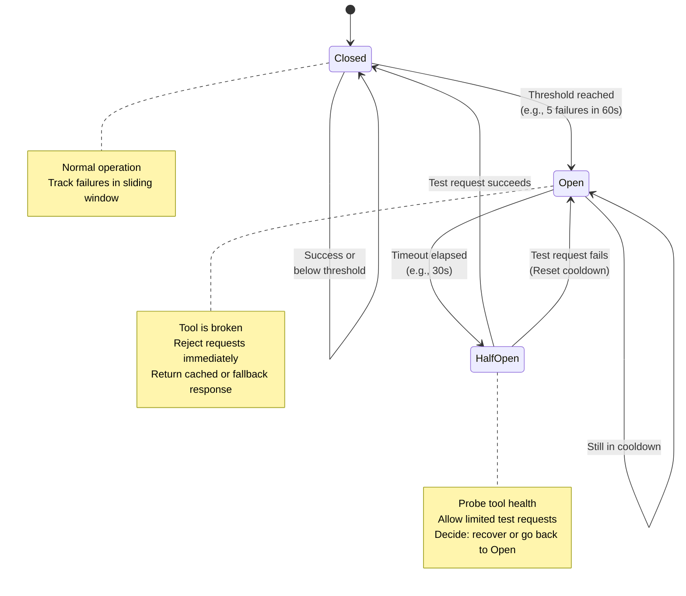

# 7. Circuit Breaker: Handling Tool Failures

## Problem Statement

When external tools, APIs, or databases misbehave or fail:
- Workers waste time retrying failing calls (cascading delays)
- Orchestrator waits indefinitely for tool results
- System resources (connections, memory) are exhausted
- LLM continues routing requests to broken tools
- User experience degrades until timeout

**Example failure modes:**
- **Slow API**: Tool takes > 30s, blocks worker
- **Intermittent Failures**: 50% of requests fail; retry storms form
- **Permanent Outage**: Tool offline; all requests timeout
- **Resource Exhaustion**: Tool returns 500 errors consistently
- **Cascading**: One broken tool backs up queue → affects other tools

---

## Solution: Circuit Breaker State Machine

Implement a **circuit breaker** per tool to track health and fail fast:



---

## States Explained

### 1. CLOSED (Healthy)
- Tool is functioning normally
- Worker executes requests
- Track failure counts in a sliding window (e.g., last 60 seconds)
- Transition to OPEN if failure threshold exceeded

**Config:**
```yaml
Failure Threshold: 5 consecutive failures
Window: 60 seconds
```

### 2. OPEN (Broken)
- Tool is suspect broken or overwhelmed
- Circuit breaker **rejects all new requests immediately** (fail-fast)
- Return error without calling tool: `{"error": "Circuit breaker OPEN for tool:search", "retry_after": 30}`
- Calculate exponential backoff before retrying
- Remain OPEN for a configured duration (cooldown period)

**Benefits:**
- Saves worker CPU and resources (no wasted calls)
- Orchestrator can make fallback decisions (cache, skip, synthesize)
- Downstream clients aren't blocked on timeout

### 3. HALF_OPEN (Recovering)
- After cooldown, allow **limited test requests** to probe recovery
- If test requests succeed → return to CLOSED
- If test requests fail → return to OPEN (extend cooldown)

**Config:**
```yaml
Cooldown Duration: 30 seconds
Test Request Quota: 2 per cooldown
Half-Open Success Ratio: 80%
```

---

## Python Implementation

```python
from enum import Enum
from time import time
from typing import Optional, Callable, Any
import asyncio

class CircuitBreakerState(Enum):
    CLOSED = "closed"
    OPEN = "open"
    HALF_OPEN = "half_open"

class CircuitBreaker:
    def __init__(
        self,
        tool_name: str,
        failure_threshold: int = 5,
        window_seconds: int = 60,
        cooldown_seconds: int = 30,
        half_open_max_calls: int = 2,
        success_ratio_threshold: float = 0.8
    ):
        self.tool_name = tool_name
        self.state = CircuitBreakerState.CLOSED
        self.failure_threshold = failure_threshold
        self.window_seconds = window_seconds
        self.cooldown_seconds = cooldown_seconds
        self.half_open_max_calls = half_open_max_calls
        self.success_ratio_threshold = success_ratio_threshold
        
        # Sliding window tracking
        self.failures = []  # List of (timestamp, error)
        self.successes = []
        self.last_open_time: Optional[float] = None
        self.half_open_calls = 0
        self.lock = asyncio.Lock()
    
    async def call(self, tool_func: Callable, *args, **kwargs) -> Any:
        """Execute tool with circuit breaker protection."""
        async with self.lock:
            state = self._check_state()
        
        # If OPEN, fail fast without calling tool
        if state == CircuitBreakerState.OPEN:
            return {
                "error": f"Circuit breaker OPEN for {self.tool_name}",
                "state": "open",
                "retry_after": self.cooldown_seconds,
                "reason": "Too many recent failures"
            }
        
        try:
            result = await tool_func(*args, **kwargs)
            await self._record_success()
            return result
        except Exception as e:
            await self._record_failure(str(e))
            
            # In Half-Open, failure means go back to Open
            if state == CircuitBreakerState.HALF_OPEN:
                async with self.lock:
                    self.state = CircuitBreakerState.OPEN
                    self.last_open_time = time()
            
            raise
    
    def _check_state(self) -> CircuitBreakerState:
        """Determine current state based on metrics."""
        now = time()
        
        # OPEN -> HALF_OPEN transition
        if self.state == CircuitBreakerState.OPEN:
            if now - self.last_open_time >= self.cooldown_seconds:
                self.state = CircuitBreakerState.HALF_OPEN
                self.half_open_calls = 0
                return CircuitBreakerState.HALF_OPEN
            return CircuitBreakerState.OPEN
        
        # Check sliding window
        self._prune_old_events(now)
        
        # CLOSED -> OPEN transition
        if self.state == CircuitBreakerState.CLOSED:
            if len(self.failures) >= self.failure_threshold:
                self.state = CircuitBreakerState.OPEN
                self.last_open_time = now
                return CircuitBreakerState.OPEN
        
        # HALF_OPEN -> CLOSED transition
        if self.state == CircuitBreakerState.HALF_OPEN:
            self.half_open_calls += 1
            if self.half_open_calls >= self.half_open_max_calls:
                success_rate = len(self.successes) / (len(self.successes) + len(self.failures) + 1e-9)
                if success_rate >= self.success_ratio_threshold:
                    self.state = CircuitBreakerState.CLOSED
                    self.failures = []
                    self.successes = []
                else:
                    self.state = CircuitBreakerState.OPEN
                    self.last_open_time = now
        
        return self.state
    
    async def _record_success(self):
        """Log successful execution."""
        async with self.lock:
            self.successes.append(time())
    
    async def _record_failure(self, error: str):
        """Log failed execution."""
        async with self.lock:
            self.failures.append((time(), error))
    
    def _prune_old_events(self, now: float):
        """Remove events outside the sliding window."""
        cutoff = now - self.window_seconds
        self.failures = [(t, e) for t, e in self.failures if t > cutoff]
        self.successes = [t for t in self.successes if t > cutoff]
    
    def get_metrics(self) -> dict:
        """Return current circuit breaker health."""
        return {
            "tool": self.tool_name,
            "state": self.state.value,
            "failures_in_window": len(self.failures),
            "successes_in_window": len(self.successes),
            "last_failure": self.failures[-1][1] if self.failures else None,
            "last_open_time": self.last_open_time,
            "health_score": len(self.successes) / (len(self.successes) + len(self.failures) + 1e-9)
        }
```

---

## Integration: Orchestrator Fallback Strategies

When a tool's circuit breaker is OPEN, the orchestrator can choose fallback actions:

```python
async def execute_tool_with_fallback(session_id, tool_name, params):
    """Execute tool with intelligent fallback logic."""
    
    circuit_breaker = circuit_breakers.get(tool_name)
    
    try:
        result = await circuit_breaker.call(execute_tool, tool_name, params)
        return {
            "type": "success",
            "value": result
        }
    
    except Exception as e:
        if isinstance(e, CircuitBreakerOpenError):
            # Tool is broken; select fallback strategy
            
            # Strategy 1: Use cached result from previous successful call
            cache_key = f"tool_result:{tool_name}:{hash(str(params))}"
            cached = await redis.get(cache_key)
            if cached:
                prometheus.counter("tool_fallback", fallback="cache").inc()
                return {"type": "cached", "value": json.loads(cached)}
            
            # Strategy 2: Use LLM-synthesized result
            prompt = f"""Tool {tool_name} is temporarily unavailable.
            Based on the user context, synthesize a reasonable response for: {params}"""
            
            llm_result = await gemini.generate(prompt, session_context)
            prometheus.counter("tool_fallback", fallback="synthesized").inc()
            return {"type": "synthesized", "value": llm_result}
            
            # Strategy 3: Skip this tool and continue workflow
            prometheus.counter("tool_fallback", fallback="skipped").inc()
            return {"type": "skipped", "reason": "Circuit breaker open"}
            
            # Strategy 4: Return error and let workflow decide
            prometheus.counter("tool_fallback", fallback="error").inc()
            return {"type": "error", "message": f"Tool {tool_name} unavailable"}
        
        else:
            # Other exception type
            raise
```

---

## Configuration: Per-Tool Circuit Breaker

```yaml
apiVersion: v1
kind: ConfigMap
metadata:
  name: circuit-breaker-config
  namespace: default
data:
  circuit_breakers: |
    {
      "tool:search": {
        "failure_threshold": 5,
        "window_seconds": 60,
        "cooldown_seconds": 30,
        "half_open_max_calls": 2,
        "success_ratio_threshold": 0.8
      },
      "tool:database": {
        "failure_threshold": 3,        # Stricter for DB
        "window_seconds": 30,
        "cooldown_seconds": 60,        # Longer recovery
        "half_open_max_calls": 1,
        "success_ratio_threshold": 0.9
      },
      "tool:payment": {
        "failure_threshold": 1,        # Very strict for payments
        "window_seconds": 300,
        "cooldown_seconds": 300,       # Long cooldown
        "half_open_max_calls": 1,
        "success_ratio_threshold": 0.99
      },
      "tool:external_api": {
        "failure_threshold": 10,       # More lenient for flaky APIs
        "window_seconds": 120,
        "cooldown_seconds": 60,
        "half_open_max_calls": 3,
        "success_ratio_threshold": 0.7
      }
    }
```

---

## Monitoring & Alerting

```python
from prometheus_client import Gauge, Counter

cb_state_gauge = Gauge(
    'circuit_breaker_state',
    'Circuit breaker state (0=closed, 1=half_open, 2=open)',
    ['tool']
)

cb_failures_total = Counter(
    'circuit_breaker_failures_total',
    'Total failures per tool',
    ['tool', 'reason']
)

cb_state_transitions = Counter(
    'circuit_breaker_transitions_total',
    'State transitions',
    ['tool', 'from_state', 'to_state']
)

# Update metrics on state change
async def update_cb_metrics(circuit_breaker, new_state):
    state_code = {"closed": 0, "half_open": 1, "open": 2}[new_state.value]
    cb_state_gauge.labels(tool=circuit_breaker.tool_name).set(state_code)
```

**Grafana Dashboard Alerts:**
```yaml
- Alert 1: Any circuit breaker enters OPEN state
  Query: circuit_breaker_state == 2
  Severity: WARNING
  
- Alert 2: Circuit breaker remains OPEN > 5 minutes
  Query: (time() - circuit_breaker_open_start_time) > 300
  Severity: CRITICAL
  
- Alert 3: High failure rate on tool
  Query: rate(circuit_breaker_failures_total[5m]) > 1 per second
  Severity: WARNING
  
- Dashboard: "Circuit Breaker Health"
  - Pie chart: % of tools in each state (CLOSED, OPEN, HALF_OPEN)
  - Time series: Failure rates per tool
  - Table: Metrics table (state, failures, successes, health score)
  - Stack graph: State transitions over time
```

---

## See Also

- [03-Components](03-components.md) - Worker pod details
- [04-Async Communication](04-async-communication.md) - Task retries
- [05-State Persistence](05-state-persistence.md) - Caching strategy for fallbacks
- [08-Deployment](08-deployment.md) - Monitoring setup
